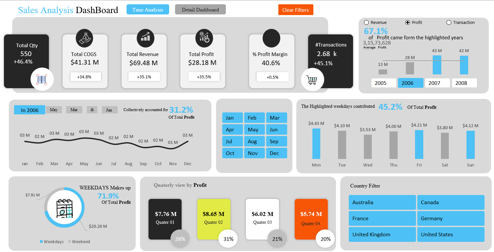
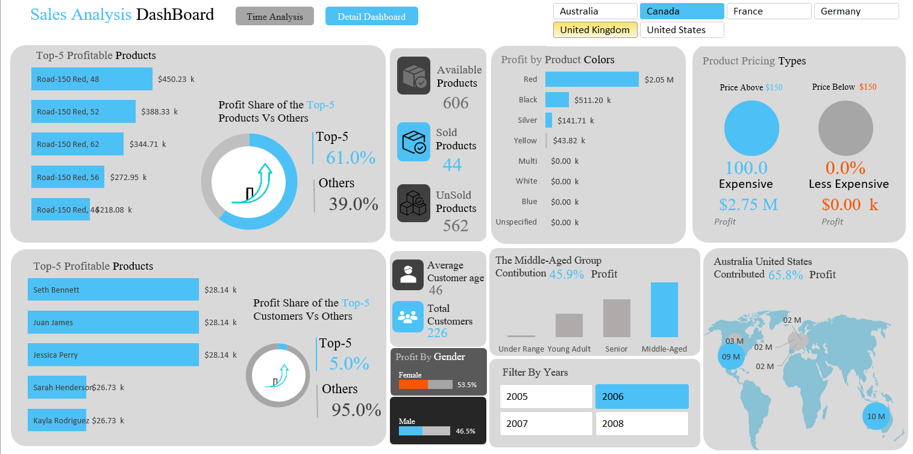

# Sales Analysis Dashboard — Excel

## Dataset
- 4 years of transactional data (2005–2008)
- 6 countries: Australia, Canada, France, Germany, UK, United States
- 226 customers | 606 products | 2,680 transactions

## Project Overview
A fully interactive, multi-page Sales Analysis Dashboard built in Microsoft 
Excel, featuring dynamic filters, cross-dashboard navigation, and business 
insights across 4 years and 6 countries.

## Dashboard Views
### 1. Sales (Time Analysis) Dashboard

### 2. Detail Dashboard

## Key Insights Uncovered
- Total Revenue: $69.48M | Total Profit: $28.18M | Profit Margin: 40.6%
- Top-5 products drive 61% of total profit
- Weekdays contribute 71.9% of total profit
- Middle-aged customers account for 45.9% of profit
- Australia + United States generate 65.8% of combined profit
- Q2 is the strongest quarter at 31% of annual profit

## Features
- Two navigable dashboards via button controls
- Dynamic slicers: Country, Year, Month, Weekday
- KPI cards with growth indicators
- Donut charts, bar charts, world map visual
- Gender and age group segmentation
- Quarterly profit breakdown

## Tools Used
- Microsoft Excel (Pivot Tables, Slicers, Charts, Conditional Formatting)

